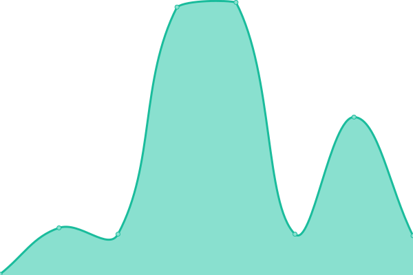

# [📈 Live Status](https://AlexScigalszky.github.io/healthcheck): <!--live status--> **🟩 All systems operational**

This repository contains the open-source uptime monitor and status page for [Alex P. Scigalszky](https://AlexScigalszky.github.io/healthcheck), powered by [Upptime](https://github.com/upptime/upptime).

With [Upptime](https://upptime.js.org), you can get your own unlimited and free uptime monitor and status page, powered entirely by a GitHub repository. We use [Issues](https://github.com/AlexScigalszky/healthcheck/issues) as incident reports, [Actions](https://github.com/AlexScigalszky/healthcheck/actions) as uptime monitors, and [Pages](https://AlexScigalszky.github.io/healthcheck) for the status page.

<!--start: status pages-->
<!-- This summary is generated by Upptime (https://github.com/upptime/upptime) -->
<!-- Do not edit this manually, your changes will be overwritten -->
<!-- prettier-ignore -->
| URL | Status | History | Response Time | Uptime |
| --- | ------ | ------- | ------------- | ------ |
|  [Palabras Aleatorias PWA](palabrasaleatorias.ar) | 🟩 Up | [palabras-aleatorias-pwa.yml](https://github.com/AlexScigalszky/healthcheck/commits/HEAD/history/palabras-aleatorias-pwa.yml) | 

 222ms
     
 | 

<a href="https://AlexScigalszky.github.io/healthcheck/history/palabras-aleatorias-pwa">100.00%</a>
    

|  [Palabras Aleatorias API](https://palabras-aleatorias-public-api.herokuapp.com/) | 🟩 Up | [palabras-aleatorias-api.yml](https://github.com/AlexScigalszky/healthcheck/commits/HEAD/history/palabras-aleatorias-api.yml) | 

 76ms
     
 | 

<a href="https://AlexScigalszky.github.io/healthcheck/history/palabras-aleatorias-api">100.00%</a>
    

|  [Twitter Post](https://palabras-aleatorias-public-api.herokuapp.com/twitter) | 🟩 Up | [twitter-post.yml](https://github.com/AlexScigalszky/healthcheck/commits/HEAD/history/twitter-post.yml) | 

 892ms
     
 | 

<a href="https://AlexScigalszky.github.io/healthcheck/history/twitter-post">100.00%</a>
    

<!--end: status pages-->

[**Visit our status website →**](https://AlexScigalszky.github.io/healthcheck)

## 📄 License

- Powered by: [Upptime](https://github.com/upptime/upptime)
- Code: [MIT](./LICENSE) © [Alex P. Scigalszky](https://AlexScigalszky.github.io/healthcheck)
- Data in the `./history` directory: [Open Database License](https://opendatacommons.org/licenses/odbl/1-0/)
